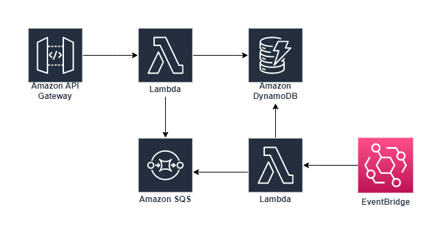
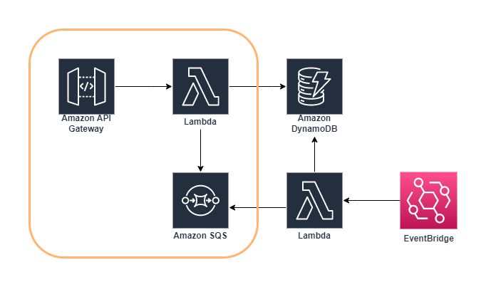
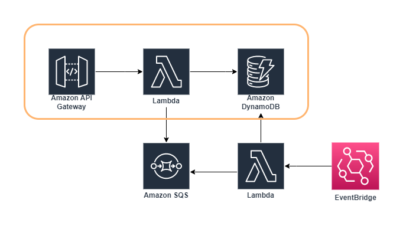
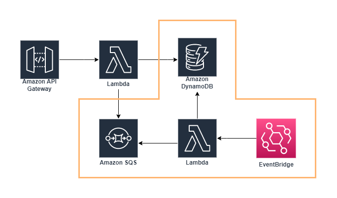
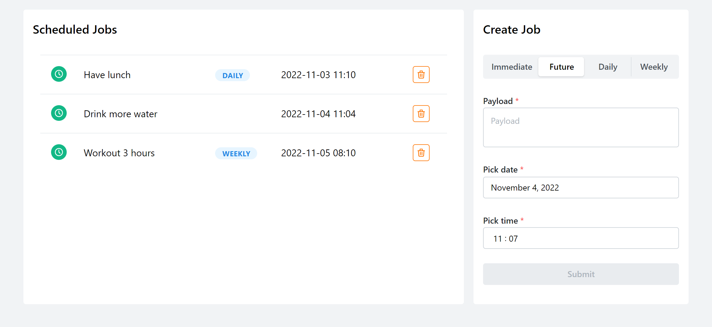

# Scheduler

A scheduling service which supports and orchestrates running tasks/jobs immediately, in the future or on a recurring basis.

## Project Structure

- `services` - AWS Lambda functions written in Node.js (TypeScript)
- `stacks` - Serverless stack definition written in TypeScript
- `web` - React application with TypeScript

## Architecture

Serverless stack on AWS



## Technologies

### Backend

- [SST](https://sst.dev/) - a framework that makes it easy to build and deploy full-stack serverless applications.
- [Amazon API Gateway](https://aws.amazon.com/api-gateway/) - a fully managed service that makes it easy for developers to create, publish, maintain, monitor, and secure APIs at any scale.
- [AWS Lambda](https://aws.amazon.com/lambda/) - a serverless, event-driven compute service that lets you run code for virtually any type of application or backend service without provisioning or managing servers.
- [Amazon DynamoDB](https://aws.amazon.com/dynamodb/) - a fully managed, serverless, key-value NoSQL database designed to run high-performance applications at any scale.
- [Amazon EventBridge](https://aws.amazon.com/eventbridge/) - a serverless event bus that lets you receive, filter, transform, route, and deliver events.
- [Amazon SQS](https://aws.amazon.com/sqs/) - a service that lets you send, store, and receive messages between software components at any volume, without losing messages or requiring other services to be available.

### Frontend

- [React](https://reactjs.org/) - a JavaScript library for building user interfaces.
- [Mantine](https://mantine.dev/) - a fully featured React components library.
- [Redux Toolkit](https://redux-toolkit.js.org/) - the official, opinionated, batteries-included toolset for efficient Redux development.
- [Tabler Icons](https://tabler-icons.io/) - an icon library with over 2900 pixel-perfect icons for web design.
- [dayjs](https://day.js.org/) - 2KB immutable date time library alternative to Moment.js with the same modern API.

## Workflow

Running jobs on their scheduled time:

- Immediate
- Future time
- Recurring (weekly/daily)

### Immediate

1. API is invoked to create an immediate job
1. API Gateway passes the request to Lambda
1. Lambda executes the job (sending a message to SQS)



### Future time

1. API is invoked to create a future job
1. API Gateway passes the request to Lambda
1. Lambda stores the job to DynamoDB



### Recurring

1. EventBridge invokes Lambda in every minute
1. Lambda checks DynamoDB for scheduled jobs
1. Lambda executes any scheduled jobs (sending messages to SQS)



## CRUD APIs

### List Schedules

```
GET /schedules
```

e.g. response:

```json
[
  {
    "payload": "Nice one",
    "jobId": "1d24b4d0-5ac7-11ed-8cbc-1fbf296d5db5",
    "recurring": "daily",
    "minute": 27791516
  }
]
```

### Get Schedule

```
GET /schedules/{jobId}
```

e.g. response:

```json
{
  "payload": "Nice one",
  "jobId": "1d24b4d0-5ac7-11ed-8cbc-1fbf296d5db5",
  "recurring": "daily",
  "minute": 27791516
}
```

### Create Schedule

```
POST /schedules
```

e.g. request body:

```json
{
  "payload": "cool stuff",
  "minute": 27789898,
  "recurring": "none"
}
```

e.g. response:

```json
{
  "jobId": "0e8bcf60-5b23-11ed-83c8-bf0a6fed592f",
  "payload": "cool stuff",
  "minute": 27789898,
  "recurring": "none"
}
```

### Update Schedule

```
PUT /schedules/{jobId}
```

e.g. request body:

```json
{
  "payload": "drink more water",
  "minute": 27789493,
  "recurring": "none"
}
```

e.g. response:

```json
{
  "payload": "drink more water",
  "jobId": "6dc533e0-5a74-11ed-b427-6dc61c712f9d",
  "recurring": "none",
  "minute": 27789493
}
```

### Delete Schedule

```
DELETE /schedules/{jobId}
```

e.g. response:

```
Status 200
```

## User Interface



### Deployment

The React application is deployed on [AWS Amplify](https://aws.amazon.com/amplify/).
